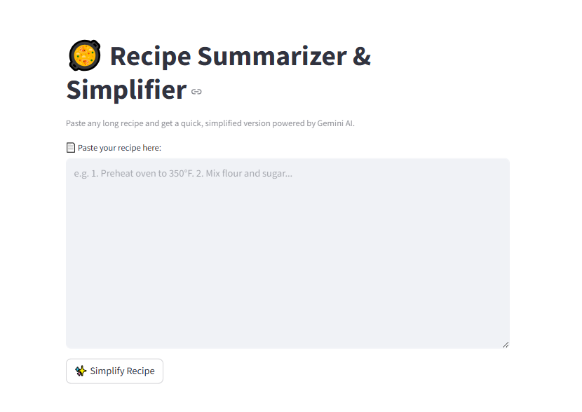

# Recipe_Summarisation_and_Simplification
# 🥘 Recipe Summarizer & Simplifier

This is a simple Streamlit app that uses **Gemini 1.5 Pro** to **summarize and simplify long, detailed recipes** into easy-to-understand instructions. Great for beginners or anyone who wants quick, clean steps for cooking.

---

## 📸 Screenshot

*Main UI of the Recipe Simplifier App built with Streamlit.*

---

## 💡 Features

- 🧾 Paste any **long recipe** and get a simplified version
- ⚡ Powered by **Gemini 1.5 Pro** API
- 🎯 Clean, minimal UI using Streamlit
- 📱 Suitable for both desktop and mobile browsers

 
